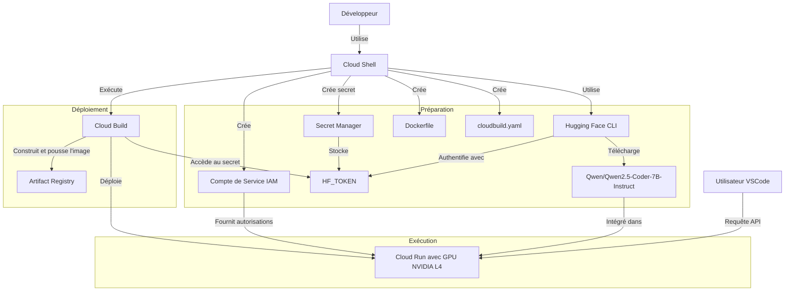

Voici un schéma Mermaid mis à jour pour refléter le processus décrit dans notre tutoriel, en utilisant Cloud Shell, un compte de service IAM, et Hugging Face CLI pour télécharger le modèle LLM google/gemma-2-2b-it :

# Explication du schéma
Le schéma Mermaid illustre le processus de déploiement d'une application utilisant un *modèle LLM (Qwen/Qwen2.5-Coder-7B-Instruct)* sur Google Cloud Platform (GCP) avec Cloud Run. Voici une explication détaillée de chaque étape :

## Préparation et configuration

1. Le développeur utilise *Cloud Shell* comme interface principale pour interagir avec les services GCP.

2. Un compte de *service IAM* est créé pour gérer les autorisations nécessaires au déploiement et à l'exécution de l'application.

3. Le token d'authentification Hugging Face (HF_TOKEN) est stocké de manière sécurisée dans *Secret Manager de GCP*.

4. Hugging Face CLI est utilisé pour télécharger le modèle *Qwen/Qwen2.5-Coder-7B-Instruct* (exemple). Il s'authentifie auprès de Hugging Face en utilisant le HF_TOKEN stocké dans Secret Manager.

5. Le développeur crée un *Dockerfile* pour containeriser l'application et un fichier *cloudbuild.yaml* pour configurer le processus de *build et de déploiement*. (l'équivalent d'un gitlab CI *.gitlab-ci.yaml*)

## Processus de déploiement

6. Cloud Build est exécuté pour orchestrer le processus de déploiement. Il accède au HF_TOKEN stocké dans Secret Manager pour authentifier le téléchargement du modèle.

7. L'image Docker de l'application est construite et poussée vers *Artifact Registry*, le registre de conteneurs de GCP.

8. Cloud Build déploie ensuite l'application sur Cloud Run, configuré pour utiliser des GPUs afin d'optimiser les performances du modèle LLM.

## Exécution et utilisation

9. Le service déployé sur Cloud Run intègre le modèle *LLM Qwen/Qwen2.5-Coder-7B-Instruct*.

10. Le compte de service IAM fournit les autorisations nécessaires au service Cloud Run pour accéder aux ressources requises.

11. Les utilisateurs peuvent maintenant faire des requêtes API au service déployé sur Cloud Run.

Cette architecture permet un déploiement sécurisé et efficace d'une application d'IA, en utilisant les meilleures pratiques de gestion des secrets et d'automatisation du déploiement sur GCP.
